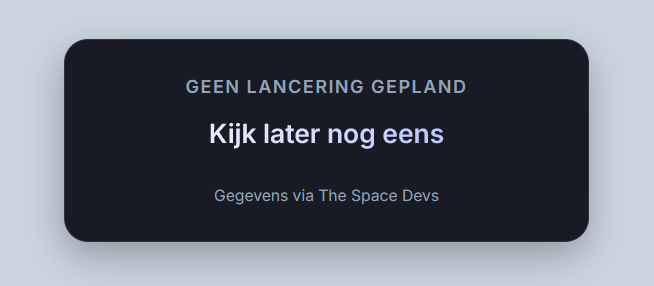

# 🚀 Space Flight Widget

[](https://opensource.org/licenses/MIT)
[](https://thespacedevs.com/)
[](https://developer.mozilla.org/en-US/docs/Web/JavaScript)

Embed upcoming heavy-lift rocket launches directly into your forum or website. A lightweight, responsive countdown widget powered by [The Space Devs API](https://thespacedevs.com/). *(Note: The widget interface is currently available in Dutch only).*


[](https://darkrain-nl.github.io/space-flight-widget/)

*Live Preview: [https://darkrain-nl.github.io/space-flight-widget/](https://darkrain-nl.github.io/space-flight-widget/)*


## ✨ Features
- **Dutch Interface**: The interface and launch statuses are currently entirely in Dutch.
- **BBCode Compatible**: Built entirely with inline styles and ES5 Javascript to bypass strict forum sanitizers and `[html]` tags.
- **Smart Logic**: Automatically displays a fallback message if there isn't a heavy-lift launch scheduled within the next 7 days.
- **Auto-Refreshing**: Refreshes data automatically every 5 minutes and recovers from API errors gracefully.
- **Zero Dependencies**: Pure HTML and JavaScript. No external CSS stylesheets or libraries required.

## 🛠️ How to Embed
Simply copy the raw, single-line code from [`dist/widget.min.html`](dist/widget.min.html) and paste it into your website or forum's HTML embed block (e.g., using `[html]...[/html]`).

## 🤝 How to Contribute
We welcome contributions! Please see our [Contributing Guide](CONTRIBUTING.md) for important technical rules you need to follow when developing for this widget (like our strict BBCode parsing constraints).

### Quick Start
1. Fork the repo and clone it locally.
2. Make your edits in `src/widget.html`. **Do not edit `dist/widget.min.html` or `index.html` directly.**
3. Run the build script to compile and minify:
   ```bash
   python3 build.py
   ```
4. Open `index.html` in your browser to preview your changes.

## 📡 Automated Updates
This repository uses a GitHub Action to automatically monitor and update to the latest version of The Space Devs API. When the API updates, a Pull Request is automatically generated to update the widget.

## 📜 Attribution
Launch data is provided by [The Space Devs](https://thespacedevs.com/).

## ⚖️ License
MIT License. See `LICENSE` for more information.
